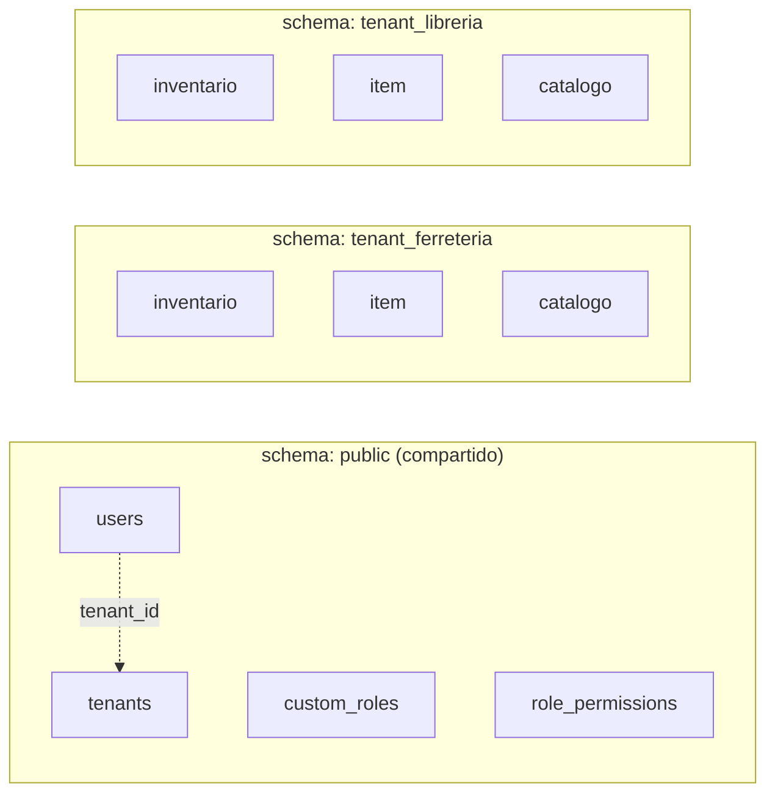
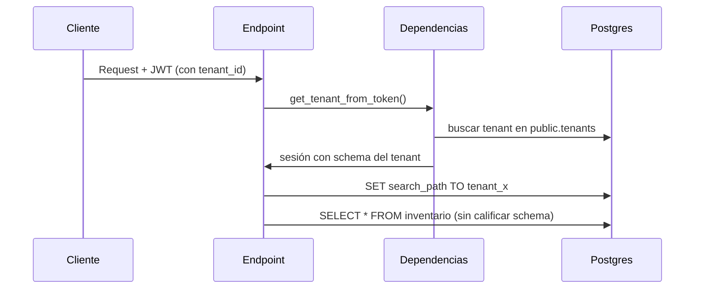
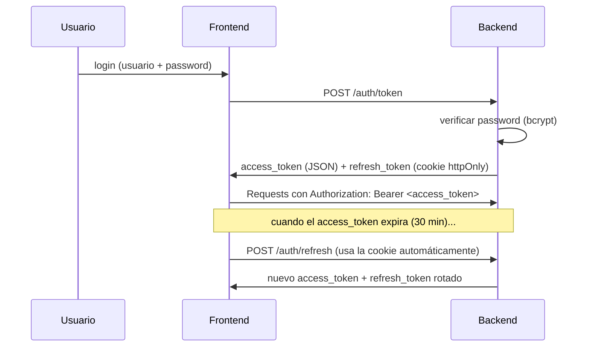
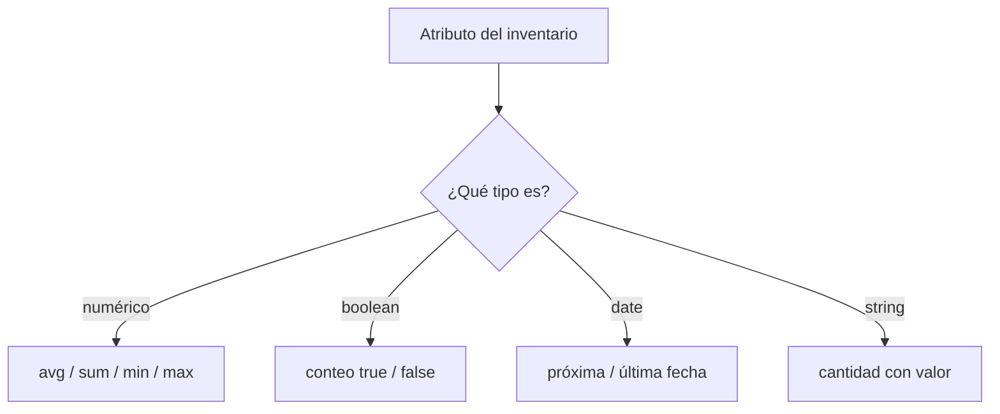
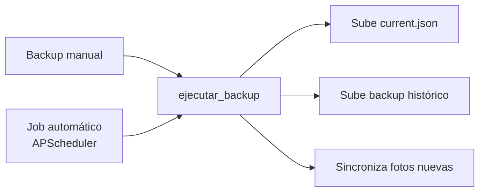
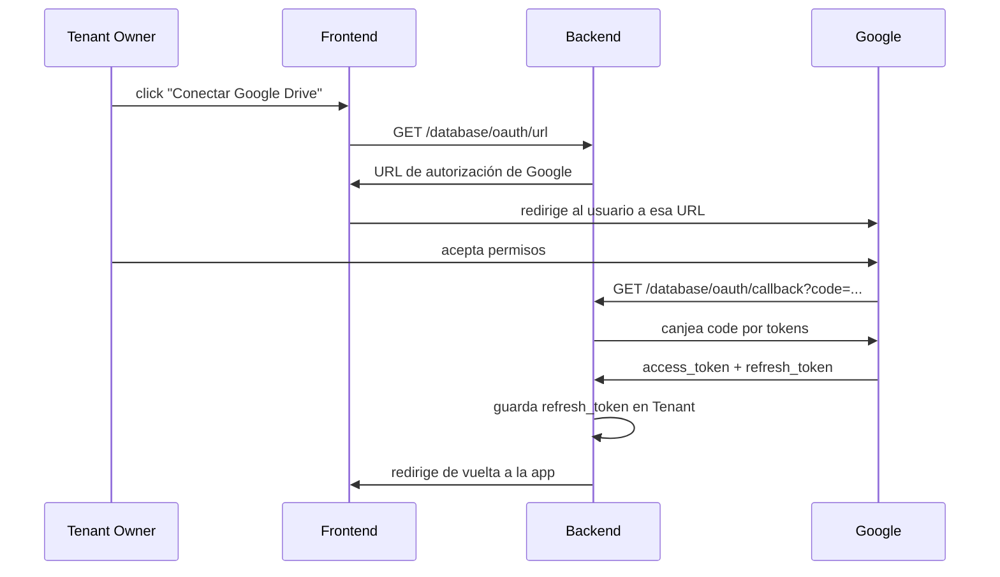

# FlexInventory — Guía de arquitectura para la presentación

> Documento de apoyo para explicar las decisiones técnicas del proyecto.
> Pensado para leer en voz alta o proyectar durante la defensa.

---

## Índice

1. [¿Es una arquitectura monolítica? ¿Por qué?](#1-es-una-arquitectura-monolítica-por-qué)
2. [Multitenancy: cómo está implementado](#2-multitenancy-cómo-está-implementado)
3. [Token y autenticación (JWT)](#3-token-y-autenticación-jwt)
4. [Atributos flexibles: JSON en vez de EAV](#4-atributos-flexibles-json-en-vez-de-eav)
5. [Operaciones de atributos en la vista de estadísticas](#5-operaciones-de-atributos-en-la-vista-de-estadísticas)
6. [Backups: cómo se generan y se guardan](#6-backups-cómo-se-generan-y-se-guardan)
7. [Google OAuth para vincular la cuenta de backup](#7-google-oauth-para-vincular-la-cuenta-de-backup)

---

## 1. ¿Es una arquitectura monolítica? ¿Por qué?

**Sí, es un monolito — pero modular.**

Todo corre en **un único proceso** de FastAPI (`app/main.py`):

- Un solo servidor sirve toda la API: auth, inventarios, items, catálogos,
  notificaciones, auditoría, backups.
- El scheduler de tareas en segundo plano (backups automáticos, evaluación
  de notificaciones) corre **dentro del mismo proceso** con `APScheduler`,
  no en un worker separado.
- Una sola base de datos Postgres para todo.

### ¿Por qué se eligió así?

| Monolito | Microservicios |
|---|---|
| Un solo deploy, un solo proceso | Orquestación, redes internas, deploys independientes |
| Debug simple (todo en un solo lugar) | Debug distribuido, trazas entre servicios |
| Suficiente para el volumen actual de uso | Se justifica con escala/equipos grandes |

Separar en microservicios agrega complejidad operativa (comunicación entre
servicios, consistencia de datos entre bases separadas, más infraestructura)
que **no se justifica** para el tamaño y la etapa actual del proyecto.

### Pero no es "una bola de barro"

Dentro del monolito, el código está separado por **dominio**, cada uno con
su router, sus modelos y sus schemas propios:

```
app/
├── Core/              → auth, tenants, roles y permisos
├── tenant/             → inventarios, items, catálogos (lógica de negocio)
├── database_manager/  → backups, conexión a Google Drive
├── notificaciones/     → alertas y motor de notificaciones
└── auditoria/          → registro de acciones (quién hizo qué)
```

Es un **monolito modular**: un solo proceso, pero con fronteras claras entre
módulos — lo que permitiría, si algún día hiciera falta, separar alguno de
estos en un servicio aparte sin reescribir todo.

---

## 2. Multitenancy: cómo está implementado

**Estrategia: schema-per-tenant.** Todos los tenants comparten la misma base
de datos Postgres, pero **cada uno tiene su propio schema** con sus propias
tablas — no es una columna `tenant_id` compartiendo las mismas tablas entre
todos.

### Dos "familias" de tablas



- **`public`**: quién es cada usuario, a qué tenant pertenece, y sus permisos.
  Esto es metadata compartida, tiene sentido que viva en un solo lugar.
- **Schema de cada tenant** (`tenant_ferreteria_central`, etc.): los datos de
  negocio — inventarios, items, catálogos. Físicamente aislados entre
  tenants.

### Cómo se crea un tenant nuevo

Al registrarse (`POST /tenants/`):

1. Se genera un nombre de schema a partir del nombre del tenant
   (ej. `"Ferretería Central"` → `tenant_ferreteria_central`).
2. Se crea el registro en `public.tenants` + el usuario owner.
3. Se crea el schema nuevo en Postgres y se clonan ahí todas las tablas de
   negocio (usando `schema_translate_map` de SQLAlchemy).
4. Si algo falla a mitad de camino, se hace rollback **y** se borra el
   schema recién creado — para no dejar un tenant a medias.

### Cómo se rutea cada request al schema correcto

Esta es la parte más delicada del proyecto:



1. El JWT del usuario lleva su `tenant_id`.
2. Se busca ese tenant en `public.tenants` y se obtiene su `schema_name`.
3. Se abre una sesión de base de datos "marcada" con ese schema.
4. Un **listener de SQLAlchemy** hace `SET search_path TO {schema}` **en
   cada transacción nueva** de esa sesión — no una sola vez al abrir la
   conexión.

> **Bug real que motivó este diseño:** si el `search_path` se seteaba una
> sola vez al abrir la sesión, y el endpoint hacía un `commit()` a mitad de
> camino (por ejemplo, antes de correr el motor de notificaciones), la
> conexión volvía al pool — y la siguiente operación podía tomar **otra**
> conexión, sin el `SET`. Resultado: errores intermitentes de "la tabla no
> existe", que solo aparecían con concurrencia real (el scheduler compitiendo
> por conexiones con los requests HTTP). Fijar el `search_path` en cada
> transacción, no en la sesión, lo resuelve de raíz.

5. El nombre del schema se valida con una regex (`^[a-z0-9_]{1,63}$`) antes
   de interpolarlo en el SQL — defensa en profundidad contra inyección SQL.

### Permisos dentro de un tenant

- **Owner** (`role = "tenant"`): acceso total, bypasea todo chequeo de
  permisos, intocable por empleados.
- **Empleado** (`role = "employee"`): solo accede a lo que le permite su
  `custom_role_id` — un rol armado por el propio tenant (ej. "jefe de
  depósito") con permisos granulares por recurso y acción
  (`inventarios:read`, `items:create`, etc.).

---

## 3. Token y autenticación (JWT)

Esquema clásico de **access token + refresh token**.



### Access token
- Vida corta: **30 minutos**.
- Payload: `sub` (username), `id`, `role`, `tenant_id`, `type: "access"`.
- Viaja en el header `Authorization: Bearer <token>` en cada request
  protegido.
- Es lo que conecta autenticación con multitenancy: el `tenant_id` del token
  es lo que determina a qué schema de base de datos se conecta el request.

### Refresh token
- Vida larga: **7 días**.
- Viaja **solo** en una cookie `httpOnly` con `path=/auth`:
  - `httpOnly` → inaccesible desde JavaScript, un ataque XSS no puede
    robarlo.
  - `path=/auth` → el navegador solo la manda a los endpoints de auth, no a
    toda la API.
  - `samesite=lax` → mitiga CSRF.
- Se **rota** en cada uso: cada vez que se pide un access token nuevo, se
  emite también un refresh token nuevo (ventana deslizante de 7 días).

### Otros detalles relevantes
- Firmado con **HS256** y una `SECRET_KEY` de variable de entorno — la app
  **no arranca** si esa variable no está configurada (evita firmar tokens
  con una clave vacía por accidente).
- **Rate limiting** de login: máximo 5 intentos fallidos por minuto, por
  combinación de IP + usuario (en memoria).
- Los **permisos no viven en el token** — se resuelven en cada request
  contra la tabla `role_permissions`. Esto significa que si un admin le
  cambia el rol a un empleado, el cambio aplica inmediatamente, sin esperar
  a que su token expire.

---

## 4. Atributos flexibles: JSON en vez de EAV

Esta es la decisión de diseño más importante del proyecto, y la más
"discutible" en una entrega académica — vale la pena explicarla bien.

### El problema

Cada inventario define sus propios atributos, con nombres y tipos
arbitrarios:

```
Inventario "Ferretería" → { precio: float, color: string, stock_minimo: integer }
Inventario "Cartas"     → { la_tengo: boolean, costo: float, edicion: string }
```

No hay un esquema fijo de columnas — cada inventario es distinto. ¿Cómo se
modela esto en una base relacional?

### La alternativa "de libro": EAV (Entity-Attribute-Value)

El patrón clásico para atributos dinámicos sería algo así:

```
tabla atributo_definicion: (inventario_id, nombre, tipo)
tabla atributo_valor:      (item_id, atributo_id, valor)
```

Cada valor de cada atributo de cada item vive en **su propia fila**.

### La decisión: una columna JSONB

En vez de eso, `Inventario.atributos` e `Item.atributos` son columnas
**JSONB** de Postgres:

```json
// Item de inventario "Ferretería"
{
  "precio": 1250.50,
  "color": "rojo",
  "stock_minimo": 10
}
```

Todos los atributos de un item viven en **una sola fila, una sola columna**.

### ¿Por qué JSON y no EAV?

| | EAV | JSONB |
|---|---|---|
| Leer un item con 5 atributos | 5 filas + JOIN | 1 fila |
| Agregar un atributo nuevo al inventario | INSERT en tabla de definiciones + migrar filas | escribir una clave más |
| `AVG(precio)` de todos los items | filtrar tabla de valores gigante por `atributo_id` | expresión directa sobre la tabla real de items |
| Soporte nativo en la base | ninguno especial | operadores `->>`, índices GIN, cast tipado |

**En números concretos:** con EAV, un inventario con 1.000 items y 5
atributos cada uno son **5.000 filas** solo para guardar los valores. Con
JSONB son **1.000 filas** — una por item, sin importar cuántos atributos
tenga.

Además, Postgres tiene soporte **nativo y maduro** para JSON: se puede
indexar, castear a tipos reales (`(atributos->>'precio')::float8`), y
consultar con SQL normal — no hace falta reinventar en la aplicación lo que
la base de datos ya resuelve.

### El costo que se acepta (a propósito)

Con JSONB **se pierde la integridad referencial automática**: no hay Foreign
Key que le impida a `roles_atributos` apuntar a un atributo que ya no
existe, ni que le impida a un item tener un valor con el tipo equivocado.

Esa integridad la mantiene **el código**, explícitamente:
- Al editar un inventario y borrar un atributo, una función
  (`clean_orphan_roles`) limpia cualquier configuración que apuntaba a ese
  atributo.
- El motor de estadísticas detecta datos que no coinciden con el tipo
  declarado y devuelve un error claro (400) en vez de romperse con un 500.

**Es una decisión consciente:** se paga con más código de validación, a
cambio de queries mucho más simples y rápidas, y de no tener que migrar el
esquema de la base cada vez que un usuario agrega un atributo nuevo a su
inventario. Este mismo criterio se repite en todo el proyecto — roles de
atributo, bloques de estadística personalizados, unidades de medida — todo
vive en columnas JSONB nuevas, nunca en tablas EAV.

---

## 5. Operaciones de atributos en la vista de estadísticas

El motor de estadísticas (`GET /inventarios/{id}/stats`) tiene que calcular
métricas distintas según el **tipo** de cada atributo — promedio para
números, conteo de verdadero/falso para booleanos, etc. — sin saber de
antemano qué atributos tiene cada inventario (porque, como vimos arriba, son
dinámicos).

### Strategy Pattern por tipo

Cada tipo de dato tiene una "estrategia" registrada, con tres
responsabilidades:



El motor **nunca** pregunta "¿qué tipo es este atributo?" con una cadena de
`if/elif` — recorre un registro de estrategias. Agregar un tipo de dato
nuevo el día de mañana es agregar una entrada al registro, sin tocar el
resto del motor (principio abierto/cerrado).

### El truco: una sola consulta SQL, sin importar cuántos atributos haya

En vez de una consulta por atributo (lento, N ida-y-vueltas a la base), se
arma **una sola query gigante**, agregando un fragmento por atributo:

```sql
SELECT
  COUNT(*) AS total_items,
  AVG((atributos ->> :key_0)::float8) AS attr_0_avg,
  SUM((atributos ->> :key_0)::float8) AS attr_0_sum,
  COUNT(*) FILTER (WHERE (atributos ->> :key_1)::boolean = true) AS attr_1_true
FROM item WHERE inventario_id = :inventario_id
```

Los alias (`attr_0_avg`) son **sintéticos**, no el nombre real del
atributo — porque un nombre como `"precio de venta (USD)"` no es un
identificador SQL válido. El nombre real del atributo (la clave `:key_0`)
sí viaja como **parámetro enlazado**, nunca pegado directo en el texto del
SQL — esto es lo que evita la inyección SQL aunque el nombre del atributo lo
haya escrito el usuario.

### Manejo de datos rotos: "camino optimista con diagnóstico"

¿Qué pasa si un item tiene guardado `"precio": "no soy un número"` (un dato
heredado o corrompido)? El cast explota — y como es una sola query gigante,
**explota toda la consulta**, no solo ese atributo.

La solución tiene dos pasos:

1. **Camino feliz**: correr la query grande directo, sin protección extra.
   Funciona el 99% de las veces y es rápido.
2. **Solo si falla**: hacer rollback y correr una segunda pasada,
   atributo por atributo, con una expresión "tolerante" que nunca explota,
   hasta encontrar exactamente **cuál** atributo y **qué** valor rompió el
   cálculo — y devolver un error 400 claro con ese detalle, en vez de un 500
   genérico o (peor) estadísticas silenciosamente incorrectas.

El costo extra de la segunda pasada solo se paga en el caso raro (dato
roto), nunca en el uso normal.

### Sobre esa misma base: mediana agrupada e histograma

Usando la función `width_bucket()` de Postgres, se calcula en una sola
consulta agregada un histograma de un atributo numérico, y con la fórmula
clásica de estadística descriptiva (mediana para datos agrupados en
intervalos) se estima la mediana sin traer los valores individuales a
Python.

---

## 6. Backups: cómo se generan y se guardan

### Qué se hace backup

Todo el schema del tenant: inventarios (con sus atributos, roles, bloques
personalizados, unidades), items, catálogos, y los usuarios/roles del
tenant. **A propósito no se incluye** la configuración de notificaciones —
es configuración transitoria de alertas, no un dato de negocio del usuario,
y perderla no importa (se reconfigura fácil).

### Dónde se guarda: el Google Drive del propio tenant

No se guarda en el servidor — se sube al Drive del usuario, con esta
estructura de carpetas:

```
FlexInventory Storage/
├── current.json          → siempre el backup más reciente (se sobreescribe)
├── backups/
│   ├── backup_2026-09-10_03-00.json
│   ├── backup_2026-09-11_03-00.json
│   └── ...                → histórico completo, uno por corrida
└── images/
    ├── a1b2c3d4.jpg        → fotos de items — un archivo por uuid
    └── ...                 → almacén "append-only": nunca se borra ni se resube
```

**¿Por qué en el Drive del cliente y no en el servidor?** El dato queda en
la cuenta del propio usuario — no consume infraestructura propia, y
sobrevive aunque el servidor se caiga o se resetee por completo.

**¿Por qué las fotos son un almacén append-only y no un .zip que se
sobreescribe?** Porque los nombres de archivo de las fotos son UUID
inmutables — cada archivo es contenido único que nunca cambia. Subir solo
los nuevos (sin resubir ni borrar) significa que **cualquier backup viejo
sigue encontrando sus fotos** en el almacén, sin duplicar decenas de fotos
iguales en cada corrida.

### Cuándo se genera



- **Manual**: botón en la app (`POST /database/backup/now`), con una
  etiqueta opcional para el nombre del archivo.
- **Automático**: un job diario (cada N horas configurable) + uno mensual
  por tenant, programados con `APScheduler` y recargados en caliente cuando
  el tenant cambia su configuración.

Ambos caminos llaman a la **misma función** (`ejecutar_backup`) — evita
tener la lógica de "armar el JSON y subirlo" escrita dos veces.

### Restaurar un backup

Es una operación **destructiva**: borra todo el schema actual del tenant y
lo reconstruye desde el JSON elegido. Después de reinsertar los datos, se
corre un paso de "saneo" que:
- Convierte columnas JSONB que quedaron en `NULL` a `{}` (los inserts son
  SQL crudo, no pasan por los defaults del ORM).
- Resincroniza las secuencias de autoincremento de los `id` (si no, el
  próximo alta pide un `id` ya ocupado y falla).

El historial de auditoría **no se restaura** — es el registro de qué pasó,
y "rebobinarlo" borraría justo la explicación de por qué hubo que restaurar.

---

## 7. Google OAuth para vincular la cuenta de backup

Flujo estándar de **OAuth2** de Google, usado solo para poder subir archivos
al Drive del tenant en su nombre.



### Los detalles que importan

- **Scope mínimo**: `drive.file` — la app solo puede ver/tocar los archivos
  que ella misma crea, no todo el Drive del usuario.
- **`access_type=offline`**: es lo que le pide a Google que devuelva un
  `refresh_token` de larga duración, necesario para que los backups
  automáticos funcionen sin que el usuario esté logueado en ese momento.
- **`prompt=consent`**: fuerza que Google vuelva a pedir permiso y entregue
  un `refresh_token` nuevo cada vez — necesario para poder reconectar la
  cuenta más adelante.
- **`state=tenant_id`**: es cómo el callback de Google sabe a qué tenant
  pertenece esa autorización (Google no sabe nada de nuestro sistema de
  tenants, solo devuelve lo que le mandamos en `state`).
- Solo se guarda el **`refresh_token`** (de larga duración) en la base;
  nunca el `access_token` (dura ~1 hora) — cada vez que hace falta operar
  sobre Drive, se pide uno nuevo con el refresh token guardado.

### Un detalle de robustez: las carpetas se identifican por ID, no por nombre

Las carpetas de Drive (`FlexInventory Storage`, `backups`, `images`) se
guardan cacheadas por su **ID** de Google, con un mecanismo de respaldo que
busca por nombre solo si el ID cacheado ya no es válido. Esto significa que
si el usuario **renombra o mueve** esas carpetas manualmente en su Drive, el
sistema sigue encontrándolas — un ID no cambia aunque cambie el nombre.

### Desconectar la cuenta

Al desconectar (`POST /database/disconnect`):
1. Se revoca el permiso en Google (best-effort — si Google no responde, se
   desconecta igual del lado local).
2. Se borran **todos** los IDs cacheados de Drive — si no se hiciera, al
   reconectar con otra cuenta de Google, el sistema intentaría operar sobre
   IDs que pertenecen a la cuenta vieja y fallaría.
3. Se desactivan los backups automáticos.

---

## Resumen para la presentación (una línea por tema)

| Tema | Idea central |
|---|---|
| **Arquitectura** | Monolito modular: un solo proceso, pero separado en dominios claros |
| **Multitenancy** | Un schema de Postgres por tenant, ruteado dinámicamente por el `search_path` |
| **Autenticación** | JWT access (30 min, header) + refresh (7 días, cookie httpOnly) |
| **Atributos flexibles** | Columna JSONB en vez de EAV: menos filas, queries más simples, se paga con validación manual |
| **Estadísticas** | Strategy Pattern por tipo + una sola query SQL dinámica, con diagnóstico solo si algo falla |
| **Backups** | JSON + fotos subidos al Drive del propio tenant, manual o automático, compartiendo la misma lógica |
| **Google OAuth** | `drive.file` + refresh token de larga duración, carpetas identificadas por ID para resistir renombres |

---
---

# Versión en criollo (sin tecnicismos)

> Misma explicación de los 7 temas, pero con analogías de la vida real —
> para explicarle a alguien que no programa (o para no trabarse en la
> defensa si te preguntan "pero explicámelo más fácil").

## 1. ¿Es un "monolito"? ¿Por qué?

Pensalo como un **local de comida** en vez de un shopping con muchos locales
separados: acá adentro hay un solo mostrador que atiende todo (los pedidos,
la caja, la cocina), en vez de tener cinco negocios distintos comunicándose
entre sí por teléfono.

¿Por qué elegimos el local único? Porque somos pocos atendiendo y el
volumen de clientes todavía no justifica abrir cinco locales separados con
sus propios empleados, sus propias cuentas y su propio delivery entre ellos.
Un local único es más fácil de armar, de arreglar si algo se rompe, y de
manejar entre poca gente.

Eso sí — **adentro del local** las tareas están organizadas por sector: hay
una zona de caja, una de cocina, una de depósito. No es un local
desordenado donde todo está mezclado — cada cosa tiene su lugar, aunque
todo esté bajo el mismo techo.

## 2. Multitenancy: varios negocios usando el mismo sistema

Imaginate un **edificio de oficinas** con muchas empresas adentro. Todas
comparten el mismo edificio (la misma base de datos), pero cada empresa
tiene **su propia oficina con llave** — nadie de la empresa del piso 3 puede
entrar a los archivos de la empresa del piso 5.

Hay una sola recepción en la planta baja (compartida por todos) que sabe
"la persona que llegó trabaja en la empresa del piso 3" y la manda ahí
directo. Esa recepción usa el carnet de identificación de la persona (ver
punto 3) para saber a qué piso mandarla — y solo puede entrar a **su
propio** piso, nunca al de otra empresa.

## 3. El "carnet" para entrar (token de autenticación)

Cuando iniciás sesión, el sistema te da algo parecido a una **pulsera de
un boliche o un festival**: mientras la tenés puesta, podés entrar y salir
sin que te pidan el documento cada vez. Pero esa pulsera **vence** — dura
30 minutos — así que si alguien te la roba, no le sirve para siempre.

Además te dan una segunda "ficha" guardada en un lugar más seguro (una
cookie especial que ni siquiera el navegador deja tocar con código) que
sirve solo para pedir una pulsera nueva cuando la primera vence — así no
tenés que escribir tu contraseña cada 30 minutos. Esa ficha dura una
semana, y cada vez que la usás te dan una nueva (para que no se pueda usar
una ficha vieja robada por mucho tiempo).

## 4. ¿Por qué guardamos los atributos como un "todo junto" y no en tablas separadas?

Cada inventario puede tener características distintas: uno de ferretería
tiene "precio" y "color", uno de cartas de colección tiene "la tengo" y
"edición". No hay una lista fija de características para todos los
inventarios.

**La forma "de manual"** sería armar una planilla enorme donde cada fila es
"este item tiene esta característica con este valor" — una fila por cada
característica de cada producto. Con 1.000 productos y 5 características
cada uno, son 5.000 filas solo para guardar los datos.

**Lo que hicimos en cambio** es más parecido a una **ficha de producto**
donde todas sus características van anotadas juntas en la misma tarjeta,
como una etiqueta de ingredientes: "precio: $500, color: rojo, stock
mínimo: 10" — todo en un solo lugar. Con 1.000 productos son 1.000
fichas, sin importar cuántas características tenga cada una.

Esto hace que sea mucho más rápido buscar y calcular cosas (leer una ficha
completa es más simple que juntar 5 filas sueltas), y que agregar una
característica nueva a un producto sea tan fácil como escribirla en su
ficha — sin tener que rehacer ninguna planilla.

Lo que se pierde: con la planilla de filas separadas, el sistema mismo te
impide poner una característica que no existe. Con la ficha libre, ese
control lo tiene que hacer el programa a mano (revisando que todo esté bien
escrito) en vez de la base de datos sola. Es un intercambio consciente:
un poquito más de código de control, a cambio de mucha más velocidad y
simpleza.

## 5. La ventana de estadísticas: ¿cómo sabe qué cuenta hacer con cada dato?

Es como un **cajero de supermercado con una calculadora inteligente**: no
importa si el producto es una fruta (se pesa), una bebida (se cuenta por
unidad) o algo con fecha de vencimiento — el cajero sabe automáticamente
qué operación corresponde según el tipo de producto, sin que nadie le diga
"este es una fruta, hacé esto".

De la misma manera, el sistema mira el **tipo** de cada característica
(número, sí/no, fecha, texto) y automáticamente sabe qué cálculo mostrar:
promedio y suma para números, cuántos "sí" y cuántos "no" para las de
sí/no, próxima fecha para las de vencimiento.

Y todo esto lo hace en **una sola pasada** — como pedirle al cajero que te
dé el total de la compra entera de una sola vez, en vez de sumar cada
producto por separado y volver a la fila cada vez.

**¿Y si un dato está mal escrito** (por ejemplo, alguien anotó "diez" en
vez de "10" en un campo de precio)? El sistema primero intenta calcular
todo normal, rápido. Si algo no cierra, ahí sí se toma el trabajo de
revisar producto por producto hasta encontrar exactamente cuál es el dato
raro, y te avisa cuál es en vez de romperse sin explicación.

## 6. Backups: la copia de seguridad

Es como sacarle una **foto completa** a todo tu inventario — todos los
productos, cantidades, características — y guardar esa foto en tu propia
carpeta de Google Drive, no en un cajón del local. Así, si algo le pasa a
la aplicación (se rompe, se borra por error), la foto está guardada en tu
cuenta personal y se puede usar para volver todo a como estaba.

Se guardan **dos tipos de copia**:
- La foto más reciente (se pisa cada vez, como una foto "de ahora").
- Un álbum histórico con una foto por cada vez que se hizo la copia — como
  fotos fechadas, para poder volver a un momento específico del pasado si
  hace falta.

Las **fotos de los productos** (las imágenes que subís) se guardan en un
álbum aparte, y ahí nunca se borra ni se repite nada — cada foto nueva se
agrega, y las viejas quedan disponibles para siempre, así cualquier copia
de seguridad vieja siempre encuentra sus fotos.

Esto pasa **automáticamente** todos los días (y una vez al mes también),
sin que nadie tenga que acordarse de hacerlo a mano — aunque también hay un
botón para hacerlo manualmente cuando uno quiere.

**Restaurar** una copia es como decir "quiero que todo vuelva a estar como
en esta foto de tal fecha" — y es un cambio grande: borra lo que hay ahora
y pone lo de la foto vieja en su lugar. Por eso es una acción que hay que
usar con cuidado.

## 7. Conectar la cuenta de Google (OAuth)

Es lo mismo que cuando una app te pide "iniciar sesión con Google" y te
aparece la pantalla de Google preguntando "¿le das permiso a esta app para
tal cosa?".

En este caso, le pedimos permiso al usuario para **guardar archivos en su
propio Drive** — nada más. Es como darle a alguien la llave de **un solo
cajón** de tu placard, no la llave de toda tu casa: la app solo puede tocar
los archivos que ella misma creó ahí, no puede ver el resto de tus fotos ni
documentos personales.

Una vez que decís que sí, Google le da al sistema un "permiso permanente"
(hasta que lo revoques) para poder seguir guardando las copias de seguridad
automáticas sin que tengas que estar ahí aprobando cada vez — como dejarle
una copia de la llave del cajón a alguien de confianza, en vez de tener que
abrirlo vos mismo cada noche.

Si en algún momento querés cortar esa conexión, hay un botón de
"desconectar" que le devuelve la llave a Google y borra cualquier rastro
guardado de esa conexión — así, si más adelante conectás otra cuenta de
Google distinta, no queda ninguna confusión con la cuenta anterior.
